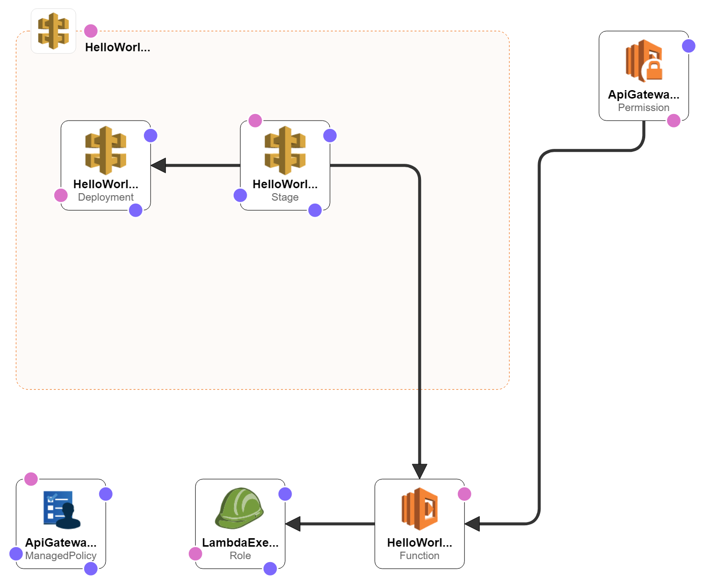

# Introduction

This repo contains a simple cloudformation script for a REST API 
created using AWS Lambda and integrated with API gateway.

## AWS Architecture

Below is the AWS component architecture of this API.

